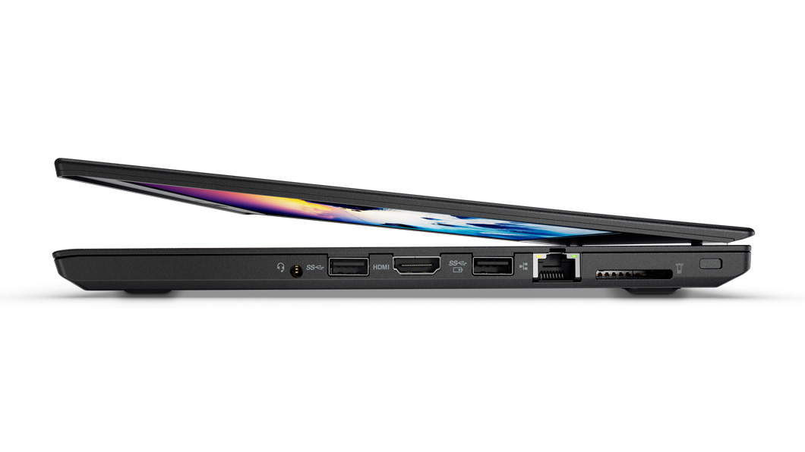
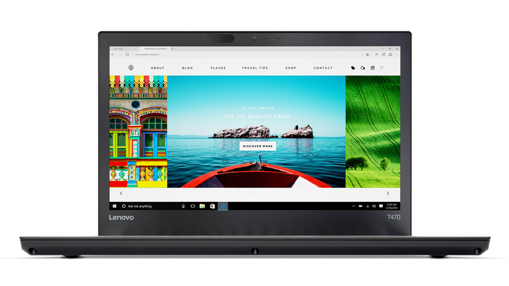
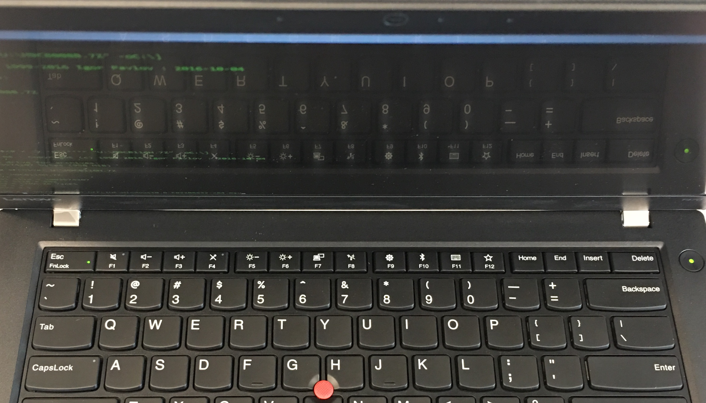
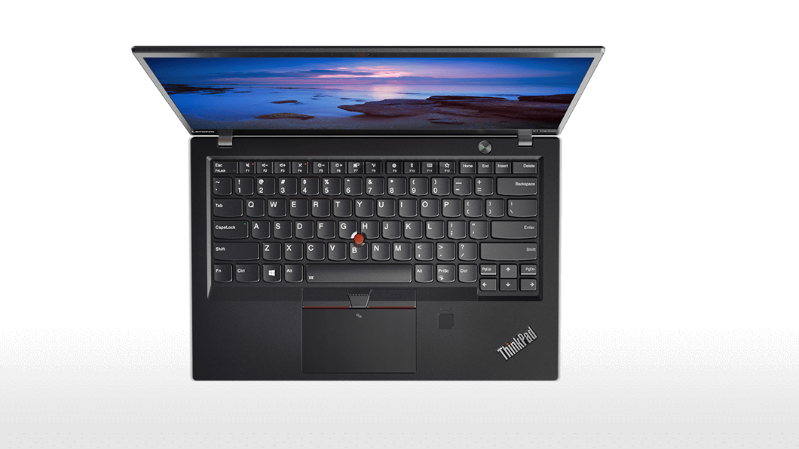

<<<<<<< HEAD
# The Internship
### Vicki Shaw
Summer 2017

#HSLIDE

### Projects
- Data Center Group Server Troubleshooting
- Asset Inventory Management System - AIMS 2.0
=======
# ThinkPad Review

The Out of Box Experience

#HSLIDE

# T470
##Windu

#HSLIDE

#### Exterior

#HSLIDE

### Exterior
- Lenovo logo debossing integrated well
- Angled bottom experience
- Hinges tight though robust
- Battery mobility
- Long cord 

>>>>>>> c1d9ed7f058e811b380a131564bd7ff638e397e3

#HSLIDE

<<<<<<< HEAD
### DCG
-- Goal: Predict server failures before they happen

- Delay in approved access for private customer information
- Insufficient training data for machine learning algorithms
- Palantir partnership was not helpful for project's goal 

#HSLIDE

### AIMS 2.0
-- Goal: Redesign and implement product engineering lab 
inventory management system and application

Technologies used:
- C# winforms application + Visual Studio
- Entity Framework 6
- MySQL database
- Brother label printer b-PAC SDK

#HSLIDE

### AIMS 2.0 - Features
- Navigate through items in your queue, or all items
- Open tabs with more details of selected items
- Add multiple items at a time
- Edit existing items
- Ship items
- Scrap items
- Print item barcodes
=======

#### Interior

#HSLIDE

### Interior
- Practical outer grip on B cover
- Large bezel
- Large gap between B-C covers
- Asynchronous plastic cover texture
- Power button and fingerprint reader aligned
 
#VSLIDE

Bowing between covers

#HSLIDE

# X1 Carbon (5th)
## Yoda

#HSLIDE

#### Interior

#HSLIDE

### Interior

- Built-in keyboard 
- Economical screen space
- Touchpoint froze upon startup, required updates
- Smooth touchpad texture
- Short charging cord, chunky adapter 

+++?image=assets/Yoda/dent.jpg
<!-- .slide: data-background-transition="none" -->
+++?image=assets/Yoda/glossyLogo.jpg
<!-- .slide: data-background-transition="none" -->
+++?image=assets/Yoda/huggingLogo.jpg
<!-- .slide: data-background-transition="none" -->
+++?image=assets/Yoda/nonHuggingLogo.jpg
<!-- .slide: data-background-transition="none" -->

#HSLIDE

###Both
- No glare with matte screen
- Uniform keyboard bevel
- Subtle charging LED
- Poor sound quality
- Muted mechanical click
- Misaligned plugs

+++?image=assets/charging\ light.jpg
<!-- .slide: data-background-transition="none" -->
+++?image=assets/Yoda/flush.jpg
<!-- .slide: data-background-transition="none" -->

>>>>>>> c1d9ed7f058e811b380a131564bd7ff638e397e3

#HSLIDE 

#Thank You
####Vicki Shaw 
####5.18.2017

