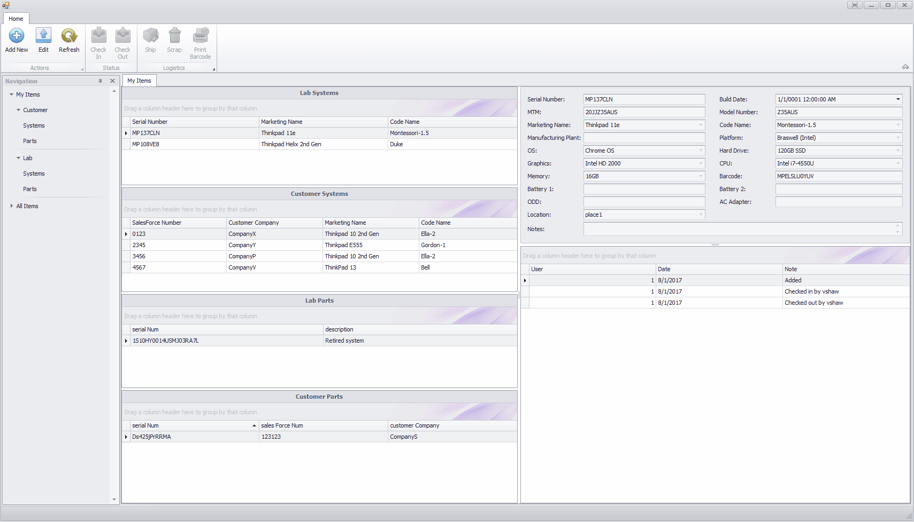
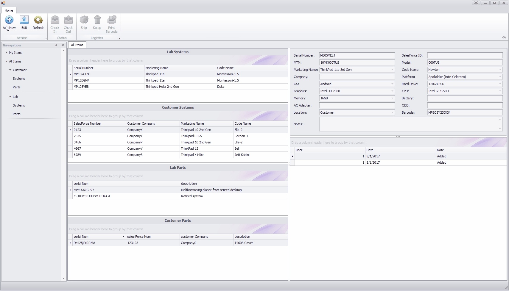
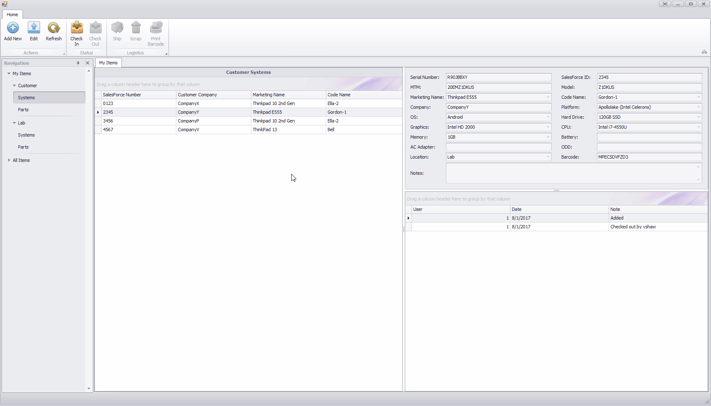
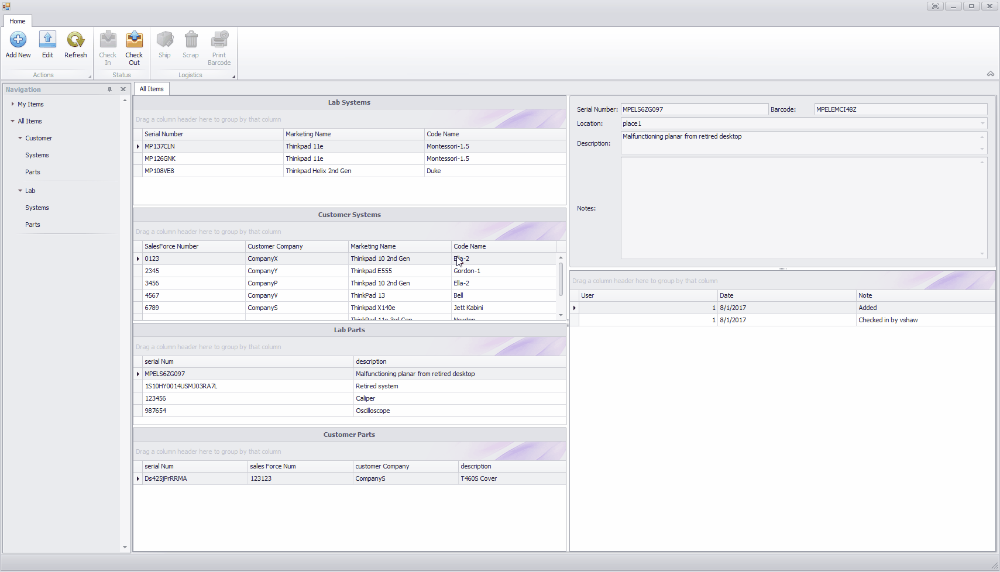
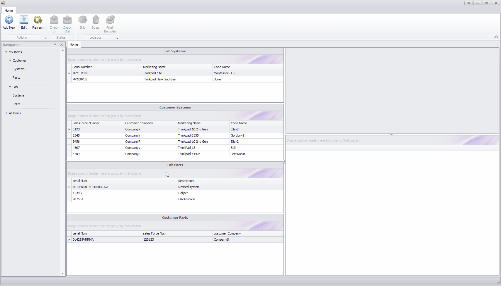
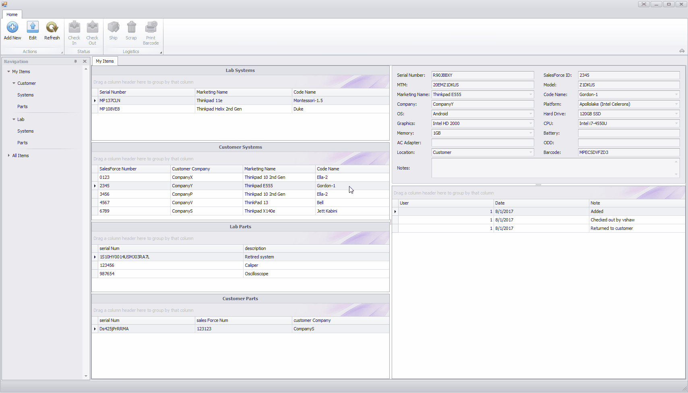
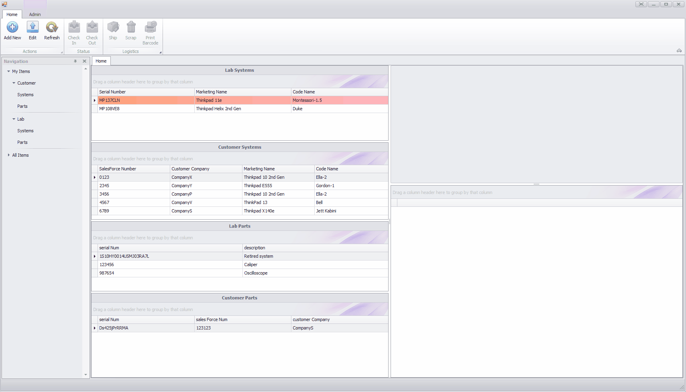

# Lenovo Summer 2017
Vicki Shaw

#HSLIDE

### Projects
- Data Center Group Server Troubleshooting
- Asset Inventory Management System - AIMS 2.0

#HSLIDE

### DCG
**Goal:** Predict server failures before they happen

- Delay in access to private customer information
- Insufficient training data for machine learning
- Palantir partnership not helpful for project 
- Project terminated early

#HSLIDE

### AIMS 2.0
**Goal:** Redesign and implement product engineering lab inventory management system 

#VSLIDE

### Technologies
- C# winforms, Visual Studio
- DevExpress
- Entity Framework 6
- MySQL database
- Dymo Label Printer SDK

#VSLIDE

### Features
- Navigate through items in your queue, or all items
- Open tabs with more details of selected items
- Add multiple items at a time
- Edit existing items
- Ship items
- Scrap items
- Print item barcodes

#VSLIDE

#### Navigation
#VSLIDE

#### Adding Items
#VSLIDE

#### Editing Items
#VSLIDE

#### Checking Items to Your Queue
#VSLIDE

#### Shipping Items
#VSLIDE

#### Scrapping Items
#VSLIDE

#### Administrators, and Ron

#HSLIDE

## AIMS 2.0: What's Next?

#VSLIDE

Documentation

    /// 
 
    /// Event handler for finish button click for add-new-item mode 
    /// 
 
    /// <param name="sender"></param> 
    /// <param name="e"></param> 
    private void bbi_add_finish_ItemClick(object sender, ItemClickEventArgs e) 
    { 
        //close UC 
        foreach (Control c in Controls.Find(UC_LABEL, false)) 
        { 
            Controls.Remove(c); 
        } 
        xtraTab_entries.Visible = true;  
        //close add ribbon page 
        ribbon_add.Visible = false; 
        //move user to home page 
        dockPanel.Visibility = DevExpress.XtraBars.Docking.DockVisibility.Visible; 
    }

#VSLIDE

### What I would do differently
- Ask more questions about users
- Design for modularity - less repeated code
- Version control

#VSLIDE

### AIMS 2.1?
- Beautification
- Flex database integration
- Increased admin functionality
- Advanced searching 
- RFID login and printing 

#HSLIDE

### Learnings
- Relational databases
- C# language
- VBA
- Powershell Script
- GitPitch and Markdown

#HSLIDE 

# Quotable Quotes

#VSLIDE

## "Your first job isn't your last"
*Robbie*

#VSLIDE

## "Do something you don't dislike" 
*Brian*

#VSLIDE

## "I still don't know what I'm doing"
*Joe*

#HSLIDE 

##Thank You
####Vicki Shaw 
####8.2.2017

